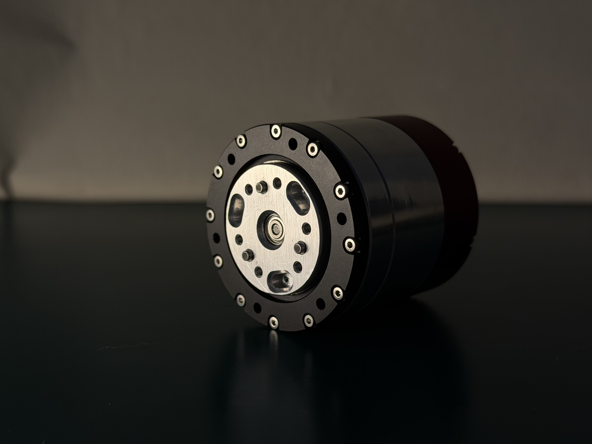
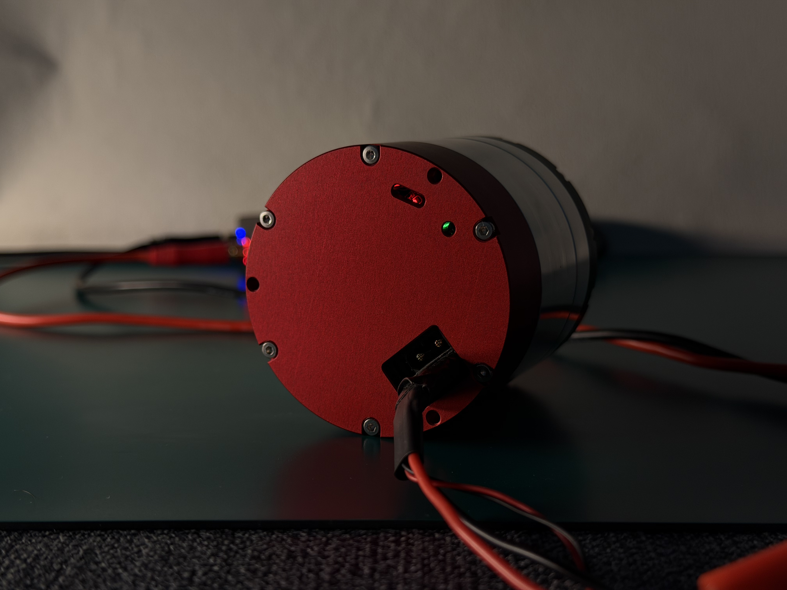
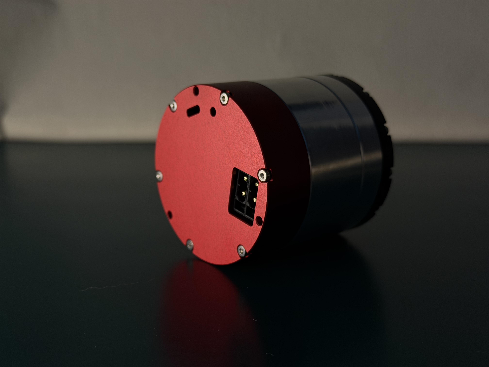
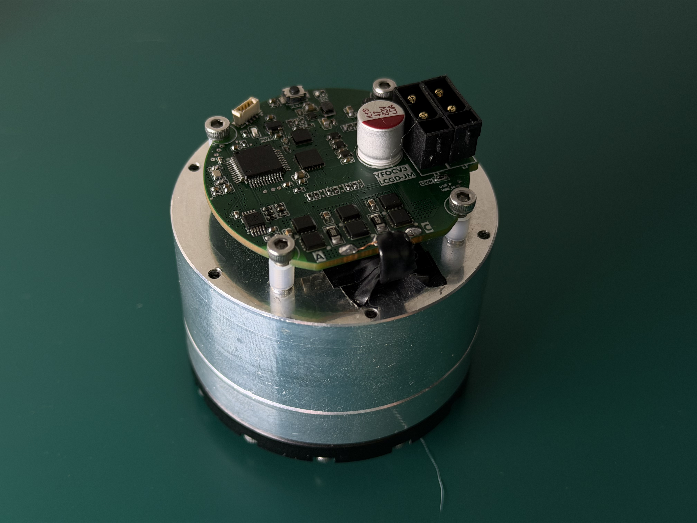
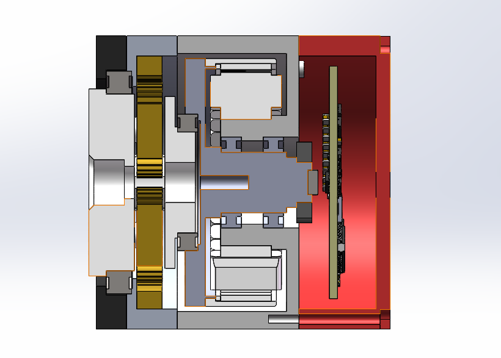

# YHorizon-JM

[中文](README.md) | [English](README.en.md)

开源关节电机。喜欢就请点个Star吧，当前仓库里的固件、SDK 和工具面向第一版样机：Classic CAN、GD32F303 驱动板。

> **本项目仅供交流学习。**
> 不保证功能可靠、不保证使用安全，也不构成任何产品认证或质量承诺。
> **禁止他人将本仓库中的设计、固件、SDK 或文档用于商业用途。**
> 使用本项目造成的人身伤害、设备损坏或其它损失，由使用者自行承担。详见 [SECURITY.md](SECURITY.md)。

<p align="center">
  
  
</p>
<p align="center">
  
  
</p>

<p align="center">
  正面（输出法兰）· 背面（电源与指示灯）· 侧面 · 内部驱动板
</p>

<p align="center">
  
</p>
<p align="center">
  机械结构（CAD）
</p>

## 当前电机

一体化关节，行星减速。第一版机械与电控：

| 项目 | 现状 |
| --- | --- |
| 外形 | 直径 57 mm，厚度 52 mm |
| 重量 | 约 300 g |
| 电机 | WK4310 参数，14 对极 |
| 减速 | 行星减速机，减速比 8 |
| 扭矩 | 额定 3 Nm，最大 6 Nm |
| 供电 | 最高 48 V |
| 编码器 | 双 MT6701 游标（30/31 齿），合成电机轴多圈后再除以减速比得到输出轴 |
| MCU | GD32F303CCT6，112 MHz |
| 功率级 | FD6288 三相驱动 |
| 总线 | Classic CAN 2.0，1 Mbps，Motor Protocol V1.0 |
| 控制 | 默认电压内环；可选电流内环。运控 / 速度 / 位置三模式 |

上电校准或加载 Flash 参数后进入运控。协议说明见 [`sdk/protocol/Motor CAN Protocol V1.0.md`](sdk/protocol/Motor%20CAN%20Protocol%20V1.0.md)（[English](sdk/protocol/Motor%20CAN%20Protocol%20V1.0.en.md)）。

测试视频：[自研关节电机阶段一完成｜D57 H52，8 倍减速，3Nm 稳定输出](https://www.bilibili.com/video/BV1CEtB6QELB/)

后续计划把主控换成 **GD32C113**，以支持 **CAN FD** 和多轴同步。机械接口与减速方案会尽量保持兼容，电控和协议会随 CAN FD 升级。

## 复刻

先对照两份清单备料、打板，不要直接下单目录里的其它文件：

- 机械零件与外购件：[`mechanical/bom/组装购买清单.xlsx`](mechanical/bom/组装购买清单.xlsx)
- 驱动器元器件：[`hardware/bom/BOM_YHorizon-JM.xlsx`](hardware/bom/BOM_YHorizon-JM.xlsx)

打板用 [`hardware/fabrication/Gerber_YHorizon-JM.zip`](hardware/fabrication/Gerber_YHorizon-JM.zip)，原理图见 [`hardware/schematic/SCH_YHorizon-JM.pdf`](hardware/schematic/SCH_YHorizon-JM.pdf)。CNC 模型在 `mechanical/cnc/`。**CNC 加工不保证和我们完全一致，建议多试、按自己的加工结果修改孔位。**

也可以买一份我们整理的多余零部件套件，省去自己打板和配齿轮、螺丝：成品驱动板、减速机齿轮和部分螺丝等。预售在闲鱼（口令 **CZ225**）：[套件链接](https://m.tb.cn/h.8FFGGjp?tk=cgNcTkelna0)。

清单之外需要自己准备的工具（不限于）：

- 压力机
- 乐泰（Loctite）螺纹胶 / 固持胶
- 内六角扳手

装配过程请看下面的视频：

- 测试：[自研关节电机阶段一完成｜D57 H52，8 倍减速，3Nm 稳定输出](https://www.bilibili.com/video/BV1CEtB6QELB/)
- 总装：_21日发布在B站_

复刻仅供交流学习，禁止商用。装配和上电前请阅读 [SECURITY.md](SECURITY.md)。

## 仓库结构

| 目录 | 内容 |
| --- | --- |
| `mechanical/cnc/` | CNC 模型 |
| `mechanical/gears/` | 齿轮 |
| `mechanical/bom/` | 零件 BOM |
| `hardware/schematic/` | 原理图 |
| `hardware/fabrication/` | 制板文件 |
| `hardware/bom/` | 元器件 BOM |
| `firmware/` | GD32F303 固件 |
| `sdk/python/` | 上位机 Python SDK / GUI |
| `sdk/protocol/` | CAN 协议 |
| `tools/` | 环境、编译、烧录脚本 |
| `images/` | 样机照片与 CAD 图 |

## 固件

需要 `arm-none-eabi-gcc` 与 CMake + Ninja。产物：`firmware/build/gd32f303/YHorizon-JM.elf`。CLion 打开 `firmware/`，选择 preset `gd32f303`。

Windows：

```powershell
.\tools\setup-env.ps1
.\tools\build.ps1
.\tools\flash.ps1
```

Ubuntu：

```bash
./tools/setup-env.sh
./tools/build.sh
./tools/flash.sh
./tools/run-gui.sh
```

`setup-env.sh` 缺什么就用 apt 装什么，并创建 `sdk/python/.venv`。烧录探针为 CMSIS-DAP + SWD。发行版 OpenOCD 一般没有 `gd32f30x` 驱动，脚本会改用 `tools/openocd-gd32f303-stm32f1x.cfg`（按 256 KB，且不做 `mass_erase`）。

## 上位机

Ubuntu 跑完 `./tools/setup-env.sh` 后可直接 `./tools/run-gui.sh`。也可手动：

```bash
cd sdk/python
python3 -m venv .venv
source .venv/bin/activate   # Windows: .venv\Scripts\Activate.ps1
pip install -r requirements.txt
python servo_gui.py
```

CLI 示例：`python servo_host.py --interface socketcan --channel can0 --id 1 --listen`。协议说明见 `sdk/protocol/`。

## 许可证

采用双重许可证，详见 [`LICENSE`](LICENSE)。**无论选用哪套许可证，本项目均仅供交流学习，禁止他人商用。**

| 内容 | 许可证 | 要点 |
| --- | --- | --- |
| `mechanical/`、`hardware/` | [CC BY-NC-SA 4.0](LICENSES/CC-BY-NC-SA-4.0.txt) | 禁止商用；衍生作品需同样开源并署名 |
| `firmware/`、`sdk/`、`tools/` | [GPLv3](LICENSES/GPL-3.0.txt) | 可学习、修改和分发；衍生软件必须继续按 GPLv3 开源 |


## 安全

完整免责声明见 [SECURITY.md](SECURITY.md)。关节电机能输出较大力矩；未完成限位、过流和急停验证前，不要在人体附近满功率运行。

## 贡献

见 [CONTRIBUTING.md](CONTRIBUTING.md)。
